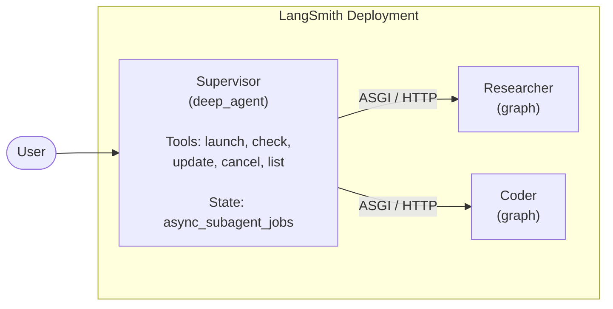
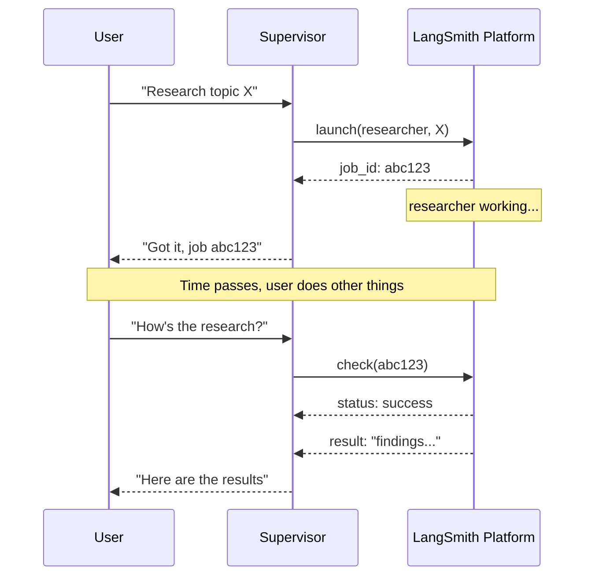
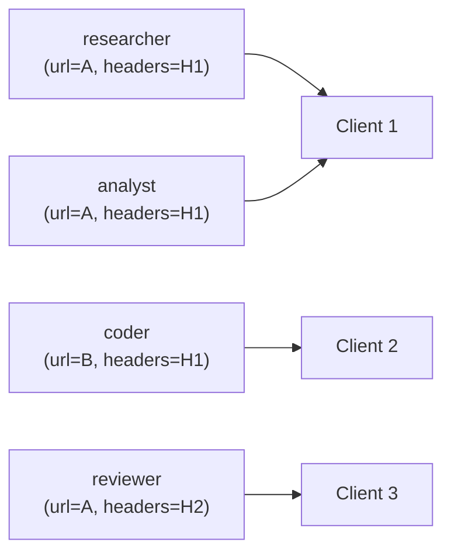
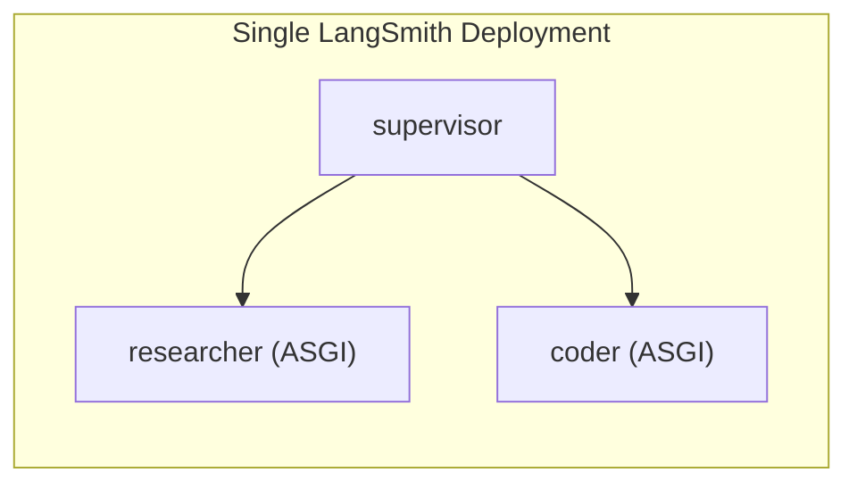
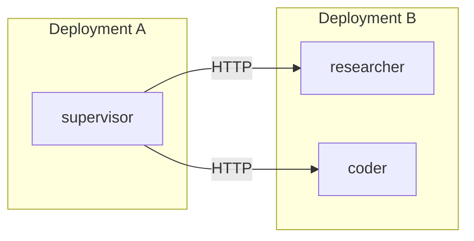
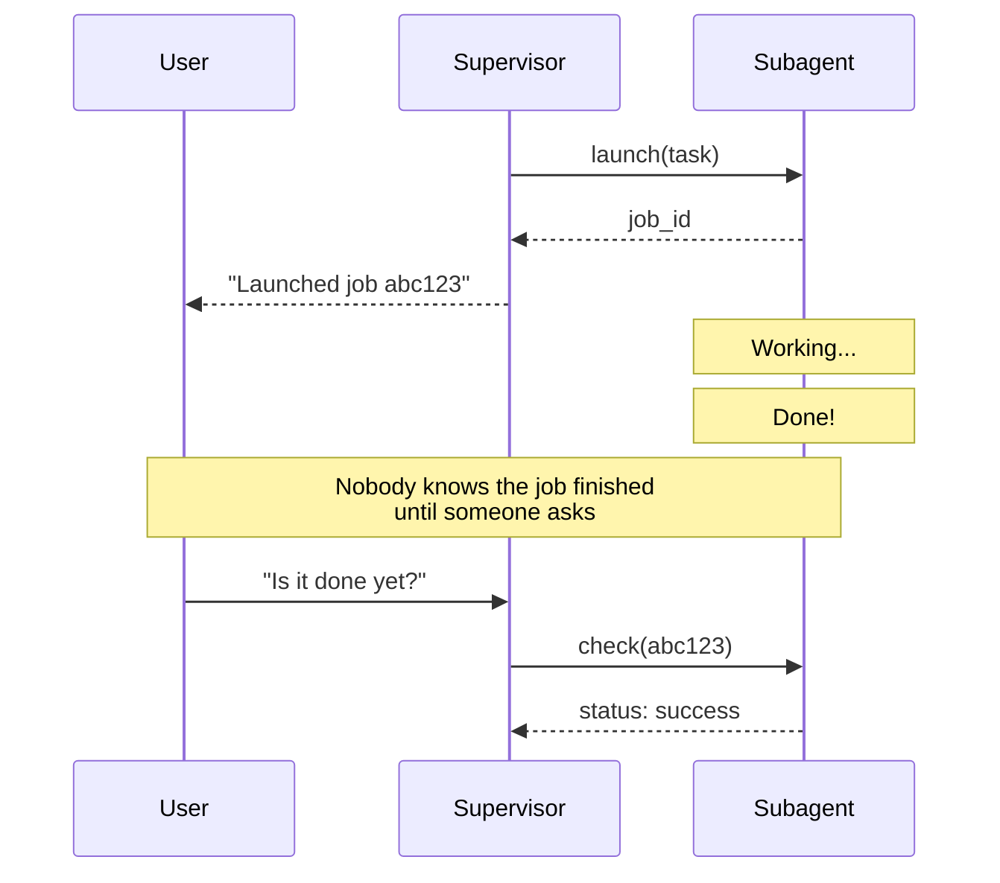
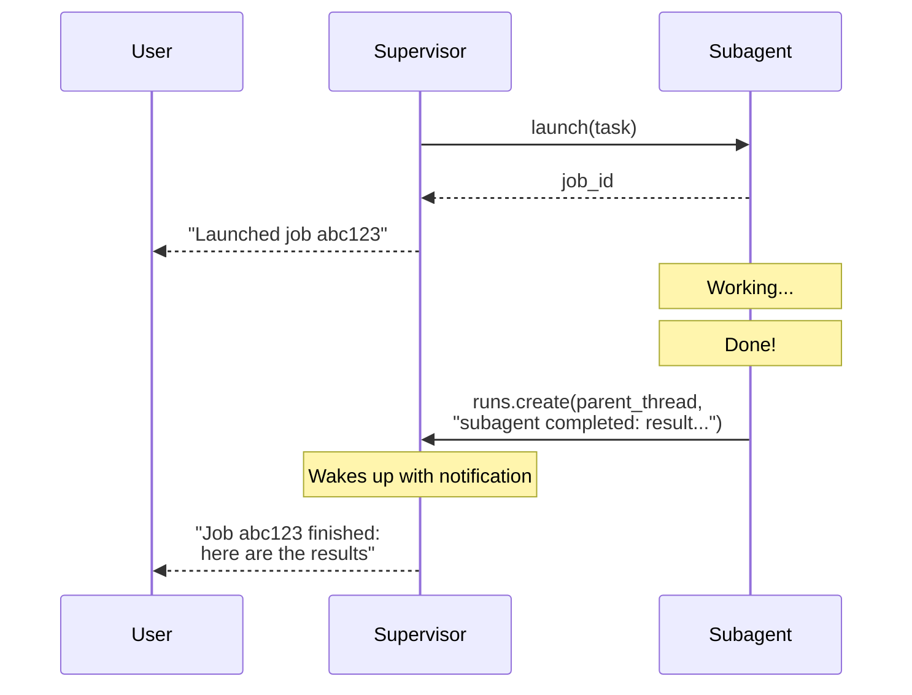

# Async Subagents: Reference Architecture

A reference implementation for non-blocking, background agent orchestration on [LangSmith Deployments](https://docs.langchain.com/langsmith/deployment) using [Deep Agents](https://docs.langchain.com/oss/python/deepagents/overview).
  
This repo demonstrates how a supervisor agent can launch specialized worker agents as background jobs, continue interacting with the user, and collect results on demand -- with full support for mid-flight updates and cancellation.

Includes working examples in both Python and TypeScript that deploy to Langsmith Deployment with a single command.

## Table of Contents

- [Motivation](#motivation)
- [Architecture](#architecture)
  - [System Overview](#system-overview)
  - [The Supervisor Pattern](#the-supervisor-pattern)
  - [Async vs Sync Subagents](#async-vs-sync-subagents)
- [The Async Subagent Protocol](#the-async-subagent-protocol)
  - [Tool Interface](#tool-interface)
  - [Lifecycle: Launch, Monitor, Steer, Collect](#lifecycle-launch-monitor-steer-collect)
  - [Job Identity](#job-identity)
- [State Management](#state-management)
  - [Job State Schema](#job-state-schema)
  - [Persistence via Command Updates](#persistence-via-command-updates)
  - [Surviving Context Compaction](#surviving-context-compaction)
- [Transport Layer](#transport-layer)
  - [ASGI Transport (Co-deployed)](#asgi-transport-co-deployed)
  - [HTTP Transport (Remote)](#http-transport-remote)
  - [Client Caching](#client-caching)
- [Deployment Topologies](#deployment-topologies)
  - [Single Deployment](#single-deployment)
  - [Split Deployment](#split-deployment)
  - [Hybrid](#hybrid)
- [Prompt Engineering](#prompt-engineering)
- [Completion Notifications](#completion-notifications)
  - [The Problem: Fire and Forget](#the-problem-fire-and-forget)
  - [The Solution: Completion Notifier Middleware](#the-solution-completion-notifier-middleware)
  - [Wiring It Up](#wiring-it-up)
  - [Why This Is Bring-Your-Own](#why-this-is-bring-your-own)
- [Production Considerations](#production-considerations)
  - [Worker Concurrency](#worker-concurrency)
  - [Thread Lifecycle Management](#thread-lifecycle-management)
  - [Observability](#observability)
- [Quick Start](#quick-start)
- [Project Structure](#project-structure)
- [Customization](#customization)
- [Related](#related)

---

## Motivation

Agents delegate work to specialized sub-agents as a form of context engineering, but up until now a lot of this interaction happened synchronously; the supervisor blocks until the sub-agent finishes:

- **Long-running tasks**: A research agent that needs 30+ seconds to search, synthesize, and write a report blocks the entire conversation.
- **Parallel workstreams**: A user asks for both a competitive analysis and a prototype implementation. Synchronous delegation forces serial execution.
- **Iterative refinement**: The user wants to redirect a sub-agent mid-task ("actually, focus on the European market instead"). Synchronous delegation offers no mechanism for this.
- **Graceful cancellation**: Requirements change and a running task is no longer needed. Synchronous delegation cannot be interrupted.

Async subagents solve these problems by decoupling task submission from result collection. The supervisor launches background jobs that return immediately with a tracking ID, then continues interacting with the user while work happens concurrently. The user (or the supervisor itself) can check progress, send updates, or cancel jobs at any point.

This architecture is built on [LangSmith Deployments](https://docs.langchain.com/langsmith/deployment) thread and run management APIs. Each background job is a standard LangGraph run on its own thread, managed through the LangGraph SDK. The `AsyncSubAgentMiddleware` layer bundled in [Deep Agents](https://docs.langchain.com/oss/python/deepagents/overview) wraps these SDK primitives into tools that an LLM can invoke naturally.

## Architecture

### System Overview



Three graphs are co-deployed within a single LangSmith deployments instance:

1. **Supervisor** (`deep_agent`) -- The user-facing agent. Uses `AsyncSubAgentMiddleware` to manage background jobs. Maintains a persistent job registry in its state.
2. **Researcher** -- A specialized agent for information gathering, analysis, and synthesis. Runs as a background job on its own thread.
3. **Coder** -- A specialized agent for code generation, review, and debugging. Also runs as a background job on its own thread.

The supervisor communicates with subagent graphs through the **LangGraph SDK**, which provides thread creation, run management, and state retrieval. When all graphs are in the same deployment, this communication happens via **ASGI transport** (in-process function calls, zero network overhead).

### The Supervisor Pattern

The supervisor does not execute domain tasks itself. Its role is to:

1. **Decompose** user requests into discrete tasks
2. **Delegate** tasks to the appropriate specialist subagent
3. **Coordinate** multiple concurrent jobs
4. **Relay** progress and results back to the user

This separation means the supervisor's context window stays focused on orchestration, while each subagent operates with a clean context dedicated to its specific task.

### Async vs Sync Subagents

LangGraph supports both synchronous and asynchronous subagent patterns. They serve different use cases:

| Dimension | Sync Subagents | Async Subagents |
|---|---|---|
| **Execution model** | Supervisor blocks until subagent completes | Returns job ID immediately; supervisor continues |
| **Concurrency** | Sequential -- one subagent at a time | Parallel -- multiple subagents run simultaneously |
| **Mid-task updates** | Not possible | Send follow-up instructions via `update` |
| **Cancellation** | Not possible | Cancel running jobs via `cancel` |
| **State isolation** | Runs within supervisor's thread | Runs on its own thread with independent state |
| **Context pressure** | Subagent output added to supervisor's context | Results fetched on demand, only when needed |
| **Best for** | Quick, predictable tasks (< 10s) | Long-running, complex, or parallelizable work |

Async subagents are strictly more capable but add operational complexity (job tracking, status polling, state management). Use sync subagents when tasks are fast and predictable; use async subagents when you need concurrency, steering, or cancellation.

## The Async Subagent Protocol

### Tool Interface

The `AsyncSubAgentMiddleware` exposes five tools to the supervisor's LLM:

| Tool | Purpose | Returns |
|------|---------|---------|
| `launch_async_subagent` | Start a new background job | Job ID (immediately) |
| `check_async_subagent` | Get current status and result of a specific job | Status + result (if complete) |
| `update_async_subagent` | Send new instructions to a running job | Confirmation + updated job state |
| `cancel_async_subagent` | Stop a running job | Confirmation + cancelled status |
| `list_async_subagent_jobs` | List all tracked jobs with live statuses | Summary of all jobs |

### Lifecycle: Launch, Monitor, Steer, Collect

A typical async subagent interaction follows this lifecycle:



**Launch** creates a new thread on the platform, starts a run with the task description as input, and returns the thread ID as the job ID. The supervisor reports this ID to the user and stops -- it does not automatically poll for completion.

**Check** fetches the current run status from the platform. If the run succeeded, it also retrieves the thread state to extract the subagent's final output. If still running, it reports that and waits for the user to ask again.

**Update** creates a _new_ run on the _same_ thread with `multitask_strategy="interrupt"`. The previous run is interrupted, and the subagent starts fresh with the full conversation history (original task + prior results) plus the new instructions. The job ID stays the same; only the internal run ID changes.

**Cancel** calls `runs.cancel()` on the platform and updates the job's cached status to `"cancelled"`.

**List** iterates over all tracked jobs in state. For non-terminal jobs (not `success`, `error`, `cancelled`, `timeout`, or `interrupted`), it fetches live status from the platform -- in parallel -- to avoid stale data. Terminal statuses are returned from cache since they will never change.

### Job Identity

Each job is identified by its **thread ID** on the Langsmith Deployment. This was a deliberate design choice:

- **Stability**: The thread ID never changes, even when the job is updated (which creates a new run on the same thread). This means the user and supervisor can track a job with one consistent ID throughout its lifecycle.
- **Opacity**: Using the raw thread ID (a UUID) prevents LLMs from attempting to decompose or interpret the ID structure. Earlier iterations used formats like `thread_id::run_id`, which caused models to split the string and pass components separately.
- **Direct lookup**: The job ID can be used directly with the LangGraph SDK to inspect the thread, retrieve state, or debug issues.

## State Management

### Job State Schema

Job metadata is stored in a dedicated state channel on the supervisor's graph. This is separate from the message history:

**Python:**
```python
class AsyncSubAgentState(AgentState):
    async_subagent_jobs: Annotated[
        NotRequired[dict[str, AsyncSubAgentJob]],
        _jobs_reducer,
    ]
```

**TypeScript:**
```typescript
const AsyncSubAgentStateSchema = new StateSchema({
  asyncSubAgentJobs: new ReducedValue(
    z.record(z.string(), AsyncSubAgentJobSchema).default(() => ({})),
    { reducer: asyncSubAgentJobsReducer },
  ),
});
```

Each `AsyncSubAgentJob` record contains:

| Field | Description |
|-------|-------------|
| `job_id` | The tracking ID (same as `thread_id`) |
| `agent_name` | Which subagent type is running (e.g., `"researcher"`) |
| `thread_id` | The LangGraph thread hosting this job |
| `run_id` | The current run ID (changes on updates) |
| `status` | Cached status: `running`, `success`, `error`, `cancelled`, etc. |

### Persistence via Command Updates

Every tool returns a `Command(update={...})` rather than a plain string. This writes job metadata directly to the state graph, alongside the tool message:

```python
return Command(
    update={
        "messages": [ToolMessage(msg, tool_call_id=runtime.tool_call_id)],
        "async_subagent_jobs": {job_id: job},
    }
)
```

The reducer merges updates into the existing jobs dict -- only the keys present in the update are overwritten:

```python
def _jobs_reducer(existing, update):
    merged = dict(existing or {})
    merged.update(update)
    return merged
```

This means a `check` call that updates one job's status does not affect any other tracked jobs.

### Surviving Context Compaction

This is the critical reason for using `Command` updates with a dedicated state channel rather than encoding job data in tool messages.

LangGraph agents compact (summarize) their message history when the context window gets long. If job IDs were only stored in tool messages, they would be lost during compaction -- the agent would forget about its running jobs.

By storing jobs in `async_subagent_jobs` (a non-message state channel), job metadata persists independently of the message history. The `list_async_subagent_jobs` tool reads directly from this state channel, so the supervisor can always recall its jobs, even after extensive conversations that trigger multiple rounds of compaction.

## Transport Layer

### ASGI Transport (Co-deployed)

When a subagent spec omits the `url` field, the LangGraph SDK uses **ASGI transport**. SDK calls are routed through in-process function calls rather than HTTP:

```python
# No url → ASGI transport
{
    "name": "researcher",
    "description": "Research agent",
    "graph_id": "researcher",
    # url intentionally omitted
}
```

This requires that both the supervisor and subagent graphs are registered in the same `langgraph.json`:

```json
{
  "graphs": {
    "supervisor": "./graphs/python/src/supervisor.py:graph",
    "researcher": "./graphs/python/src/researcher.py:graph",
    "coder": "./graphs/python/src/coder.py:graph"
  }
}
```

ASGI transport is the recommended default. It eliminates network latency, simplifies deployment (one artifact to manage), and requires no additional auth configuration. The subagent still runs as a separate thread with its own state -- the only difference is the transport mechanism.

### HTTP Transport (Remote)

Adding a `url` field switches to HTTP transport, where SDK calls go over the network to a remote LangGraph deployment:

```python
{
    "name": "researcher",
    "description": "Research agent",
    "graph_id": "researcher",
    "url": "https://my-research-deployment.langsmith.dev",
}
```

Authentication is handled by the LangGraph SDK, which reads `LANGSMITH_API_KEY` (or `LANGGRAPH_API_KEY`) from environment variables. An `x-auth-scheme: langsmith` header is added to all requests by default.

Use HTTP transport when subagents need independent scaling, resource isolation, or when they're maintained by different teams.

### Client Caching

The middleware lazily creates SDK clients and caches them by the tuple `(url, resolved_headers)`. Multiple subagent specs pointing at the same server with the same headers share a single client instance, avoiding redundant connections.



## Deployment Topologies

### Single Deployment

All graphs in one `langgraph.json`. Supervisor uses ASGI transport.



**This is the topology used in this repo** and the recommended starting point. One deployment to manage, zero network latency between graphs, and the simplest possible configuration.

### Split Deployment

Supervisor in one deployment, subagents in another. Useful when subagents need different compute profiles or independent scaling.



### Hybrid

Some subagents co-deployed via ASGI, others remote via HTTP. This is the pattern used in production at LangSmith's Agent Builder, where the general-purpose subagent is co-deployed and specialized agents may run on separate infrastructure.

```python
ASYNC_SUBAGENTS = [
    {
        "name": "researcher",
        "description": "...",
        "graph_id": "researcher",
        # No url → ASGI transport (co-deployed)
    },
    {
        "name": "coder",
        "description": "...",
        "graph_id": "coder",
        "url": "https://coder-deployment.langsmith.dev",
        # url present → HTTP transport (remote)
    },
]
```

## Prompt Engineering

The middleware injects a system prompt section that instructs the supervisor on correct async subagent usage. This is not cosmetic -- it is load-bearing. Without it, LLMs exhibit several failure modes:

1. **Immediate polling**: The model launches a job, then immediately calls `check` in a loop, effectively turning async execution into blocking execution.
2. **Phantom status reports**: The model references a job status from a previous tool call in the conversation history, reporting stale information instead of making a fresh `check` call.
3. **ID truncation**: The model abbreviates or reformats the job ID, causing lookup failures.
4. **Premature collection**: The model tries to synthesize results before checking whether the job has actually completed.

The injected prompt addresses each of these by establishing explicit rules:

- "After launching, ALWAYS return control to the user immediately"
- "Never poll `check_async_subagent` in a loop"
- "Job statuses in conversation history are ALWAYS stale"
- "Always show the full job_id -- never truncate or abbreviate it"

## Completion Notifications

### The Problem: Fire and Forget

The async subagent protocol has a gap: once the supervisor launches a job, there is no built-in mechanism for the subagent to signal that it has finished. The supervisor only learns about completion when it (or the user) explicitly calls `check_async_subagent`.

This creates a polling-dependent workflow:



For short tasks this is fine. For long-running jobs, it means the user has to keep asking, or the supervisor has to guess when to check.

### The Solution: Completion Notifier Middleware

A **completion notifier** is a middleware added to the subagent's stack that, when the subagent finishes, sends a message back to the supervisor's thread. This wakes the supervisor up and lets it proactively relay results:



The notifier works by calling `runs.create()` on the **supervisor's** thread, which queues a new run with the completion message as input. From the supervisor's perspective, it looks like a new user message arrived -- except the content is a structured notification from the subagent.

This repo includes reference implementations in both languages:
- **Python**: [`graphs/python/src/middleware/completion_notifier.py`](graphs/python/src/middleware/completion_notifier.py)
- **TypeScript**: [`graphs/typescript/src/middleware/completionNotifier.ts`](graphs/typescript/src/middleware/completionNotifier.ts)

### Wiring It Up

The notifier needs two pieces of information that only the supervisor has: its **thread ID** and **assistant ID**. These are needed to address the `runs.create()` call back to the right place. How you pass them to the subagent is deployment-specific:

| Approach | How it works | Used by |
|----------|-------------|---------|
| **Config-based** | Supervisor passes IDs via `config.configurable` when launching | LangSmith Agent Builder |
| **Input-based** | Include IDs as metadata in the launch message | Custom deployments |
| **Store-based** | Write IDs to a shared LangGraph store namespace | Multi-tenant setups |

The examples in this repo use the config-based approach. When the notifier is enabled, each subagent graph switches from a static export to a **dynamic graph factory** that reads the parent IDs from config at startup:

**Python:**
```python
@contextlib.asynccontextmanager
async def graph(config: RunnableConfig):
    configurable = config.get("configurable", {})
    notifier = build_completion_notifier(
        parent_thread_id=configurable.get("parent_thread_id"),
        parent_assistant_id=configurable.get("parent_assistant_id"),
        subagent_name="researcher",
    )
    yield create_agent(
        model=model,
        tools=[...],
        middleware=[notifier],
    )
```

**TypeScript:**
```typescript
export async function* graph(config: RunnableConfig) {
  const notifier = buildCompletionNotifier({
    parentThreadId: config.configurable?.parentThreadId,
    parentAssistantId: config.configurable?.parentAssistantId,
    subagentName: "researcher",
  });
  yield createAgent({
    model,
    tools: [...],
    middleware: [notifier],
  });
}
```

Each subagent graph in this repo includes the notifier wiring as commented-out code that you can enable.

### Why This Is Bring-Your-Own

The completion notifier is intentionally **not** part of the `AsyncSubAgentMiddleware` itself. This is a deliberate architectural decision for several reasons:

1. **The middleware runs on the supervisor side.** `AsyncSubAgentMiddleware` provides tools to the supervisor. The notifier runs on the subagent side. These are different graphs, potentially in different deployments, with different middleware stacks.

2. **Parent context passing is deployment-specific.** The notifier needs the supervisor's thread and assistant IDs, but how those get to the subagent depends on your infrastructure. LangSmith Agent Builder uses `config.configurable`; your deployment might use input metadata, a shared store, or environment variables.

3. **Not all deployments need it.** For short-lived subagent tasks, polling via `check` is fine. The notifier adds a reverse dependency (subagent → supervisor) that may not be appropriate for all architectures, especially split deployments where the subagent may not have network access back to the supervisor.

4. **Error handling is application-specific.** The reference implementation notifies on both success and error. You may want different behavior: retry on error, notify a monitoring system, update an external database, etc.

## Production Considerations

### Worker Concurrency

In a co-deployed setup, the supervisor and all subagents share the Langsmith Deployment's worker pool. Each active run (supervisor + N concurrent subagent jobs) occupies a worker slot. Configure the pool size accordingly:

```bash
langgraph dev --n-jobs-per-worker 20
```

A supervisor with 3 concurrent subagent jobs requires 4 worker slots (1 supervisor + 3 subagents). Under-provisioning causes subagent launches to queue until a slot frees up.

### Thread Lifecycle Management

Each `launch` call creates a new thread on the platform. Threads persist until explicitly deleted. For long-running deployments:

- Implement thread cleanup for completed/cancelled jobs (e.g., a periodic sweep that deletes threads older than N hours)
- Monitor thread count as a proxy for accumulated job history
- Consider archiving thread data for audit/debugging before deletion

### Observability

Every async subagent run is a standard LangGraph run, fully visible in LangSmith:

- The supervisor's trace shows tool calls for `launch`, `check`, `update`, `cancel`, and `list`
- Each subagent run appears as a separate trace, linked by thread ID
- Job status transitions are recorded in the supervisor's state history

Use the thread ID (job ID) to correlate supervisor orchestration traces with subagent execution traces.

---

## Quick Start

### Prerequisites

- **Python 3.11+** with [uv](https://docs.astral.sh/uv/) (for Python examples)
- **Node.js 20+** with [pnpm](https://pnpm.io/) (for TypeScript examples)
- An **Anthropic API key** (or swap the model in the graph files)

### Install, configure, run

```bash
git clone https://github.com/langchain-ai/async-subagents.git
cd async-subagents

# Install dependencies
make bootstrap

# Configure environment
cp .env.example .env
# Edit .env with your API keys

# Run locally (Python)
make dev-py

# Or run locally (TypeScript)
make dev-ts
```

This starts a local LangGraph dev server with all three graphs running in the same process. Open LangGraph Studio to interact with the supervisor.

### Deploy to Langsmith Deployments

```bash
make deploy-py    # Python
make deploy-ts    # TypeScript
```

## Project Structure

```
async-subagents/
├── Makefile                  # bootstrap, dev, deploy targets
├── langgraph.json            # Langsmith Deployment config (Python)
├── langgraph.ts.json         # Langsmith Deployment config (TypeScript)
├── .env.example
│
├── graphs/
│   ├── python/
│   │   ├── pyproject.toml                    # Dependencies: deepagents, langchain, langgraph
│   │   └── src/
│   │       ├── agent.py                      # create_deep_agent + AsyncSubAgentMiddleware
│   │       ├── researcher.py                 # create_agent with research tools
│   │       ├── coder.py                      # create_agent with code tools
│   │       └── middleware/
│   │           └── completion_notifier.py    # BYO: push notifications to supervisor
│   │
│   └── typescript/
│       ├── package.json                      # Dependencies: deepagents, @langchain/langgraph-sdk
│       ├── tsconfig.json
│       └── src/
│           ├── agent.ts                      # createDeepAgent + createAsyncSubagentMiddleware
│           ├── researcher.ts                 # createAgent with research tools
│           ├── coder.ts                      # createAgent with code tools
│           └── middleware/
│               └── completionNotifier.ts     # BYO: push notifications to supervisor
│
└── docs/
    ├── how-it-works.md       # Protocol sequence diagrams
    └── deployment.md         # Deployment topologies and scaling
```

## Customization

### Adding a new subagent

1. Create a new graph file (e.g., `graphs/python/src/analyst.py`) using `create_agent`
2. Register it in `langgraph.json`:
   ```json
   { "analyst": "./graphs/python/src/analyst.py:graph" }
   ```
3. Add the spec to the supervisor's `ASYNC_SUBAGENTS`:
   ```python
   {
       "name": "analyst",
       "description": "Data analysis and visualization agent",
       "graph_id": "analyst",
   }
   ```

### Pointing a subagent at a remote deployment

Add `url` to the spec. Authentication is handled via `LANGSMITH_API_KEY`:

```python
{
    "name": "researcher",
    "description": "Research agent",
    "graph_id": "researcher",
    "url": "https://my-research-deployment.langsmith.dev",
}
```

### Swapping the LLM

The graph files use `ChatAnthropic` by default. Replace with any `langchain` chat model:

```python
from langchain_openai import ChatOpenAI
model = ChatOpenAI(model="gpt-4o", temperature=0)
```

## Related

- [deepagents](https://github.com/langchain-ai/deepagents) -- Python SDK providing `AsyncSubAgentMiddleware` ([PR #1758](https://github.com/langchain-ai/deepagents/pull/1758))
- [deepagentsjs](https://github.com/langchain-ai/deepagentsjs) -- TypeScript SDK providing `createAsyncSubagentMiddleware` ([PR #323](https://github.com/langchain-ai/deepagentsjs/pull/323))
- [Langsmith Deployment](https://langchain-ai.github.io/langgraph/concepts/langgraph_platform/) -- The runtime that hosts these graphs
