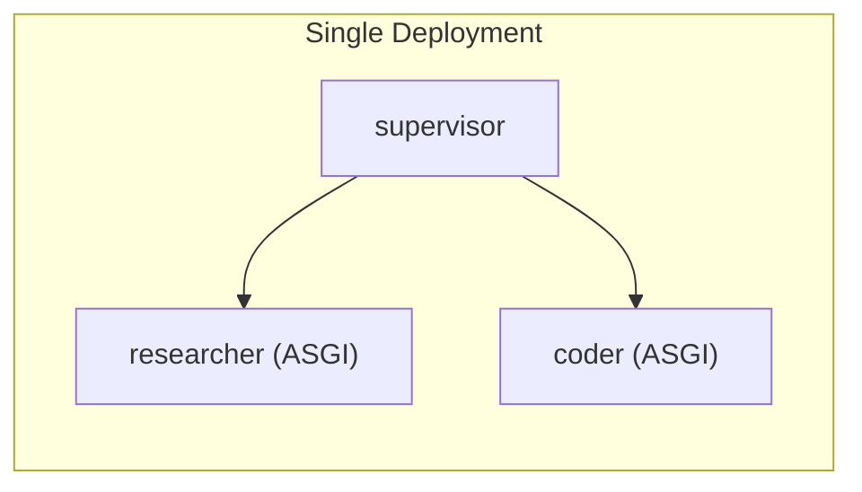
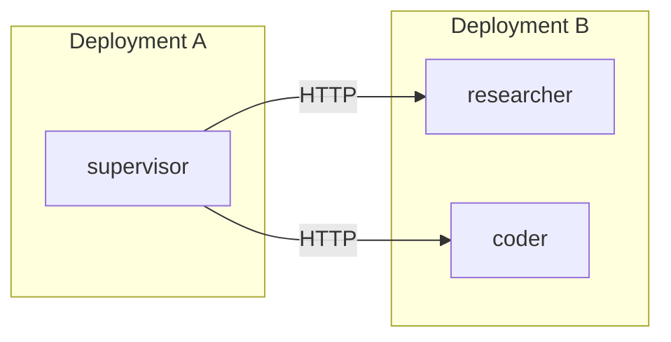

# Deployment Guide

## Local Development

### Python

```bash
make install-py
make dev-py
```

This runs `langgraph dev` which starts a local LangGraph server with hot reload. All three graphs (supervisor, researcher, coder) run in the same process.

The dev server will be available at `http://localhost:2024`. You can interact with it via:
- LangGraph Studio (opens automatically unless `--no-browser` is set)
- The LangGraph SDK
- Direct API calls

### TypeScript

```bash
make install-ts
make dev-ts
```

Same as Python but using the TypeScript graphs.

## LangGraph Cloud Deployment

### Prerequisites

1. A [LangSmith](https://smith.langchain.com) account
2. The `LANGSMITH_API_KEY` environment variable set
3. Your LLM provider API key(s) set

### Deploy

```bash
# Python
make deploy-py

# TypeScript
make deploy-ts
```

This uses `langgraph deploy` which:
1. Packages the graphs and dependencies
2. Pushes to LangGraph Cloud
3. Creates a deployment with all graphs registered

### Configuration

The `langgraph.json` / `langgraph.ts.json` files declare which graphs are available:

```json
{
  "graphs": {
    "supervisor": "./graphs/python/src/supervisor.py:graph",
    "researcher": "./graphs/python/src/researcher.py:graph",
    "coder": "./graphs/python/src/coder.py:graph"
  }
}
```

All graphs in the same config file are co-deployed, enabling ASGI transport between them.

## Deployment Topologies

### Single Deployment (Recommended)

All graphs in one `langgraph.json`. Supervisor uses ASGI transport (no `url` in specs).



**Pros**: Simplest setup, no network latency, one deployment to manage.
**Cons**: All graphs share compute resources.

### Split Deployment

Supervisor in one deployment, subagents in another (or separate ones). Add `url` to specs.



```python
ASYNC_SUBAGENTS = [
    {
        "name": "researcher",
        "description": "...",
        "graph_id": "researcher",
        "url": "https://deployment-b.langsmith.dev",
    },
]
```

**Pros**: Independent scaling, resource isolation.
**Cons**: Network latency on SDK calls, two deployments to manage.

### Hybrid

Some subagents co-deployed, others remote.

```python
ASYNC_SUBAGENTS = [
    {
        "name": "researcher",
        "description": "...",
        "graph_id": "researcher",
        # No url → ASGI transport (co-deployed)
    },
    {
        "name": "coder",
        "description": "...",
        "graph_id": "coder",
        "url": "https://coder-deployment.langsmith.dev",
        # url present → HTTP transport (remote)
    },
]
```

## Environment Variables

| Variable | Required | Description |
|----------|----------|-------------|
| `ANTHROPIC_API_KEY` | Yes* | Anthropic API key (if using Claude) |
| `OPENAI_API_KEY` | Yes* | OpenAI API key (if using GPT) |
| `LANGSMITH_API_KEY` | For deploy | LangSmith API key for platform auth |
| `LANGGRAPH_API_URL` | No | Override LangGraph API URL |

*At least one LLM provider key is required.

## Scaling Considerations

### Worker concurrency

For deployments with async subagents, increase `--n-jobs-per-worker` since the supervisor and subagents share the worker pool:

```bash
langgraph dev --n-jobs-per-worker 20
```

### Thread management

Each async subagent job creates a new thread. Threads persist until explicitly deleted. For long-running deployments, consider implementing thread cleanup for completed jobs.

### Completion notifications

For production use, consider adding a [completion notifier middleware](how-it-works.md) to subagent graphs. This sends a message to the supervisor's thread when a subagent finishes, so the supervisor can proactively report results instead of waiting for the user to ask.
