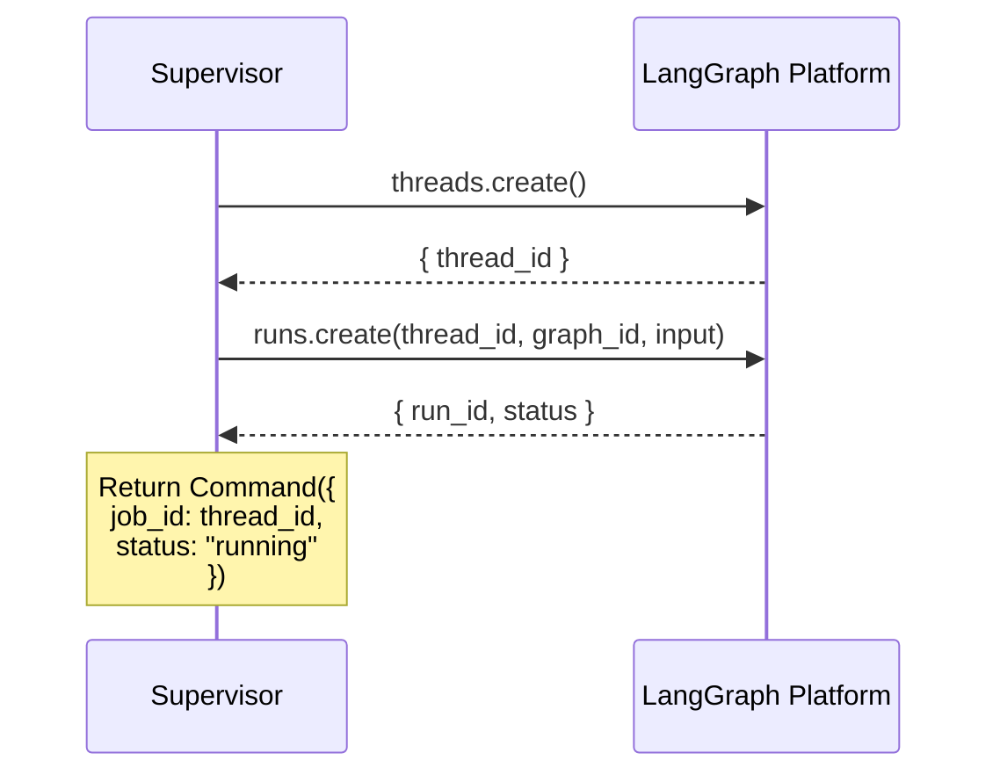
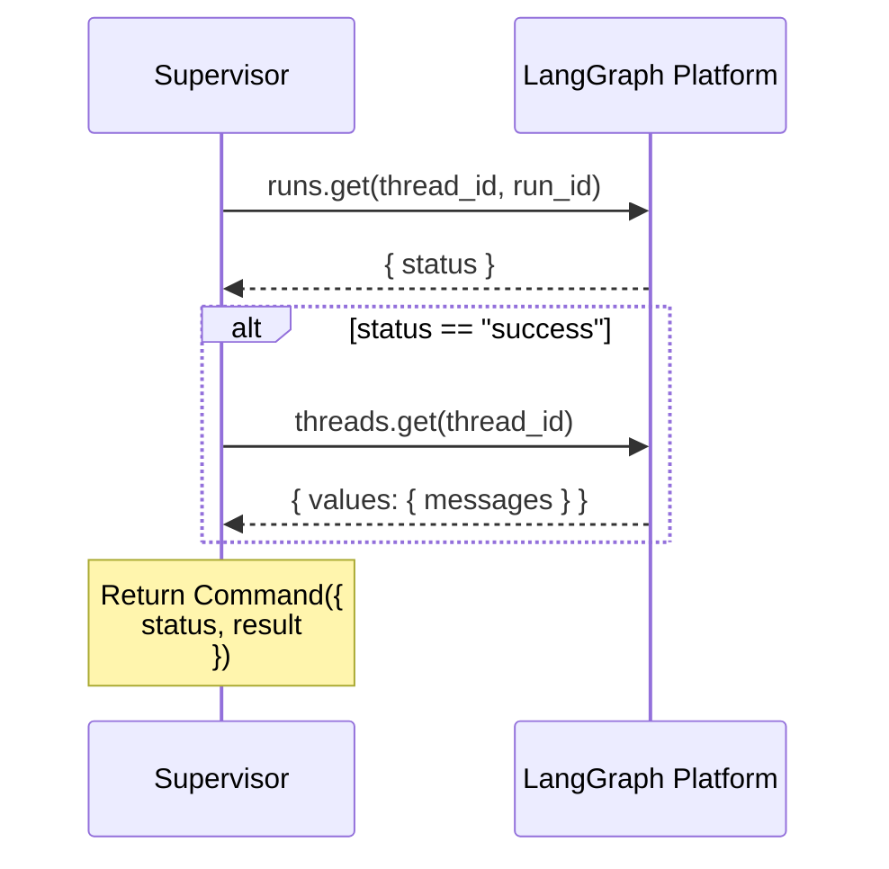
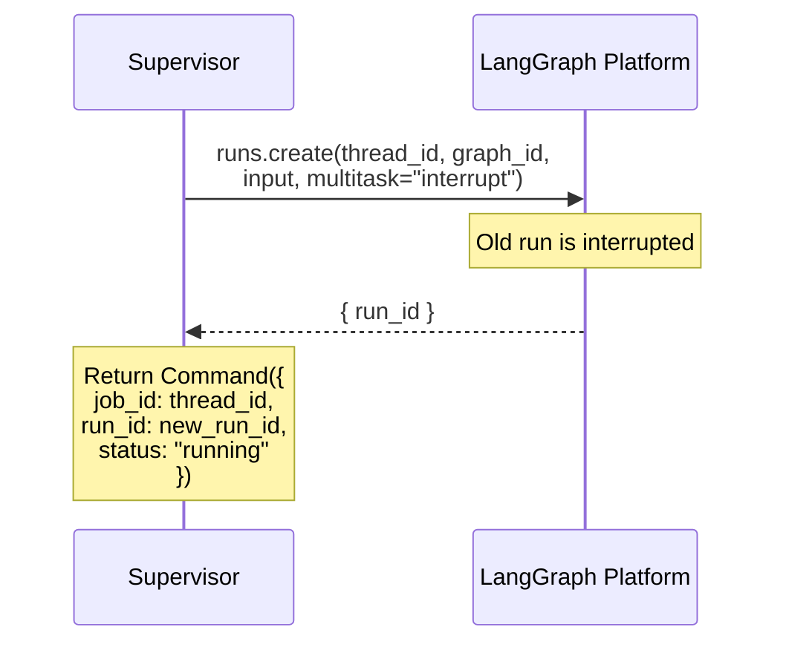
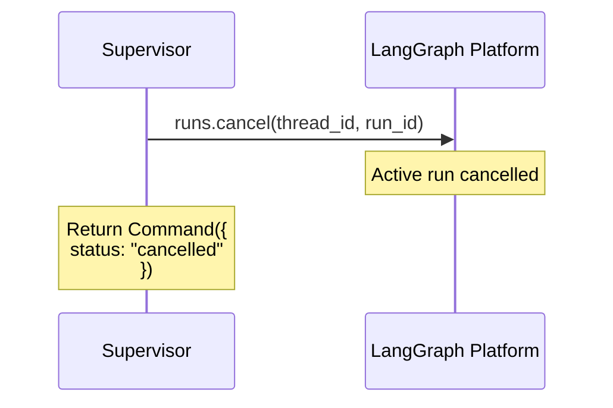
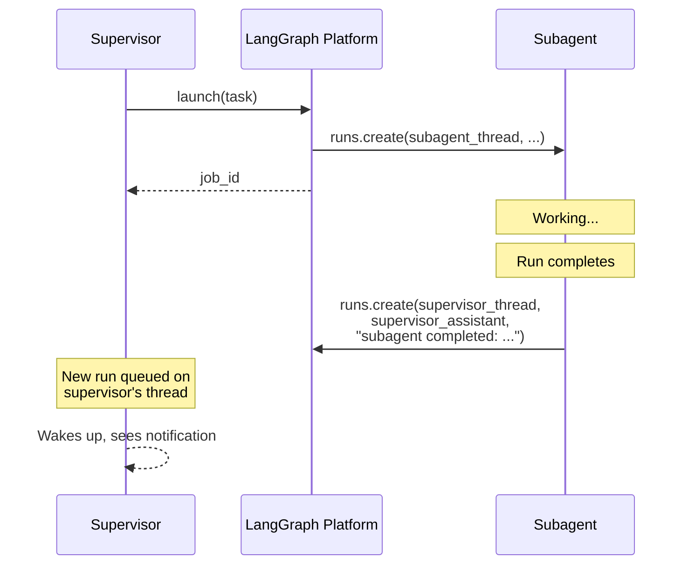

# How Async Subagents Work

This document explains the internal mechanics of the async subagent system.

## Overview

Async subagents are LangGraph graphs that run as background jobs on LangGraph Platform. A supervisor agent manages them through the LangGraph SDK, which provides thread and run management APIs. The `AsyncSubAgentMiddleware` wraps these SDK calls into tools that the supervisor's LLM can invoke.

## The Protocol

### 1. Launch

When the supervisor calls `launch_async_subagent`:



The job ID is the thread ID. This is stable -- updates create new runs on the same thread, but the thread (and job ID) stays the same.

### 2. Check

When the supervisor calls `check_async_subagent`:



### 3. Update

When the supervisor calls `update_async_subagent`:



The subagent sees the full conversation history (original task + any prior outputs) plus the new message, because everything is on the same thread.

### 4. Cancel



### 5. List

Lists all tracked jobs from state. For non-terminal jobs, fetches live status from the server (in parallel). Terminal statuses (`success`, `error`, `cancelled`, `timeout`, `interrupted`) are returned from cache to avoid unnecessary API calls.

## State Management

### Job State Schema

Jobs are stored in the supervisor's state under the `async_subagent_jobs` key:

```python
# Python
class AsyncSubAgentState(AgentState):
    async_subagent_jobs: Annotated[
        NotRequired[dict[str, AsyncSubAgentJob]],
        _jobs_reducer
    ]
```

```typescript
// TypeScript
const AsyncSubAgentStateSchema = new StateSchema({
  asyncSubAgentJobs: new ReducedValue(
    z.record(z.string(), AsyncSubAgentJobSchema).default(() => ({})),
    { reducer: asyncSubAgentJobsReducer }
  ),
});
```

### Reducer

The reducer merges updates into the existing jobs dict:

```python
def _jobs_reducer(existing, update):
    merged = dict(existing or {})
    merged.update(update)
    return merged
```

This means tools can update a single job without overwriting the full map. Only the keys present in `update` are replaced.

### Command Updates

Every tool returns a `Command(update={...})` rather than a plain string. This writes job metadata directly to state, bypassing the normal message-based state updates:

```python
return Command(
    update={
        "messages": [ToolMessage(msg, tool_call_id=runtime.tool_call_id)],
        "async_subagent_jobs": {job_id: job},
    }
)
```

This is critical because it means job IDs survive context compaction -- even if old messages are summarized away, the job records remain in state.

## Client Caching

The `_ClientCache` (Python) / `ClientCache` (TypeScript) class lazily creates SDK clients and caches them by `(url, headers)`. If two subagent specs point at the same server with the same headers, they share one client.

All clients automatically include an `x-auth-scheme: langsmith` header for LangGraph Platform auth unless a custom one is provided.

## ASGI Transport

When `url` is omitted from a subagent spec, the LangGraph SDK uses ASGI transport. This means:

- The SDK calls go through in-process function calls, not HTTP
- No network latency between supervisor and subagent
- Both graphs must be in the same `langgraph.json` deployment
- The subagent still runs as a separate thread/run with its own state

This is the recommended setup for co-deployed graphs and the default in this repo.

## Completion Notifier Protocol

The async subagent protocol is inherently fire-and-forget: the supervisor launches a job and has no way to learn it finished until someone calls `check`. The **completion notifier** is an optional middleware on the subagent side that closes this gap.

### How it works



The notifier calls `runs.create()` on the **supervisor's** thread and assistant ID. This queues a new run on the supervisor, which processes the notification as if it were a new user message.

### What the notifier needs

| Parameter | What | Where it comes from |
|-----------|------|---------------------|
| `parent_thread_id` | Supervisor's thread ID | Passed at launch via config/input/store |
| `parent_assistant_id` | Supervisor's assistant ID | Passed at launch via config/input/store |
| `subagent_name` | Identifier for the notification message | Set at graph creation time |

### Hooks

The notifier fires on two middleware hooks:

- **After agent** (`afterAgent` in TS, `aafter_agent` in Python): Fires when the subagent run completes successfully. Extracts the last message as a summary and sends it to the supervisor.
- **Wrap model call** (`wrapModelCall` in TS, `awrap_model_call` in Python): Wraps every model invocation to catch exceptions. Sends an error notification to the supervisor before re-raising.

### Why it's not built-in

See the [README's Completion Notifications section](../README.md#completion-notifications) for the full rationale. In short: the notifier runs on the subagent side (not the middleware side), requires deployment-specific context passing, and not all architectures need it.

## System Prompt Injection

The middleware appends instructions to the supervisor's system prompt explaining:
- What tools are available and what they do
- The correct workflow (launch → report → check on request)
- Critical rules about not auto-polling after launch
- When to use async vs sync delegation

This prompt engineering is important -- without it, LLMs tend to immediately check status after launching, creating a blocking loop that defeats the purpose of async execution.
